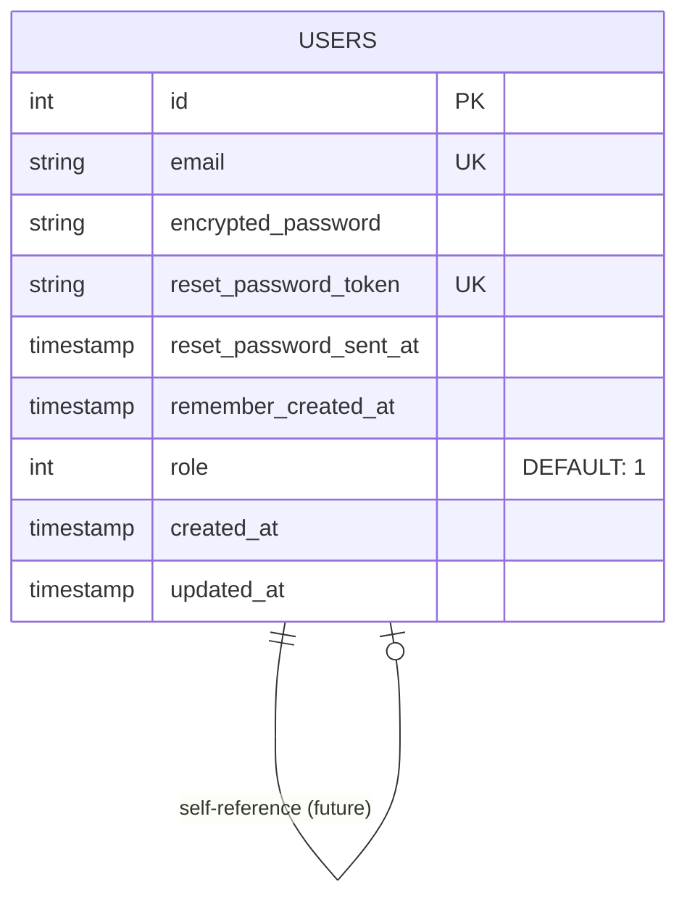

# Diagrama ER (Entity-Relationship) - Onboarding Record

## Diagrama Mermaid (Visualizable en GitHub)



---

## Estructura Simplificada

```
┌─────────────────────────────────────────┐
│              USERS (Usuarios)           │
├─────────────────────────────────────────┤
│ 🔑 id                    : INTEGER      │
│ 📧 email                 : VARCHAR      │
│ 🔐 encrypted_password    : VARCHAR      │
│ 🔑 reset_password_token  : VARCHAR      │
│ ⏰ reset_password_sent_at: TIMESTAMP    │
│ 🔔 remember_created_at   : TIMESTAMP    │
│ 👤 role                  : INTEGER      │
│    ├─ 0 = Admin                         │
│    ├─ 1 = Usuario                       │
│    └─ 2 = Reclutador                    │
│ ⏱️  created_at            : TIMESTAMP    │
│ ⏱️  updated_at            : TIMESTAMP    │
└─────────────────────────────────────────┘
         ▲
         │ Índices:
         │ • email (UNIQUE)
         │ • reset_password_token (UNIQUE)
         │ • role (REGULAR)
         │
```

---

## Vista del Sistema Actual

```
┌──────────────────────────────────────────────────────────┐
│             ONBOARDING RECORD DATABASE                   │
│                    (PostgreSQL)                          │
└──────────────────────────────────────────────────────────┘
                          │
                          ▼
                   ┌─────────────┐
                   │   USERS     │ ◄─── Tabla única
                   │             │      (sin FK externas)
                   │  9 columnas │
                   │  3 índices  │
                   └─────────────┘
                          │
            ┌─────────────┼─────────────┐
            │             │             │
            ▼             ▼             ▼
        (Admin)      (Usuario)     (Reclutador)
           1              1              1
        usuario       usuario        usuario
     con permisos    estándar      en desarrollo
```

---

## Estadísticas de Base de Datos

```
╔════════════════════════════════════════╗
║     ESTADÍSTICAS ACTUALES              ║
╠════════════════════════════════════════╣
║ Base de datos      │ PostgreSQL        ║
║ Tablas             │ 1                 ║
║ Columnas totales   │ 9                 ║
║ Índices            │ 3                 ║
║ Relaciones (FK)    │ 0                 ║
║ Registros usuarios │ 3                 ║
║ Usuarios admin     │ 1                 ║
╚════════════════════════════════════════╝
```

---

## Ciclo de Vida del Usuario

```
           CREACIÓN
              │
              ▼
      ┌───────────────┐
      │    USUARIO    │
      │   REGISTRADO  │
      └───────────────┘
              │
              ├──► Email: verificado ✓
              ├──► Contraseña: hasheada ✓
              └──► Rol: asignado (por defecto "usuario")
                        │
                        ▼
                ┌──────────────┐
                │   ACTIVO     │
                └──────────────┘
                        │
         ┌──────────────┼──────────────┐
         │              │              │
         ▼              ▼              ▼
    EDITAR PERFIL  RESET PASS.   ELIMINACIÓN
         │              │              │
         └──────────────┴──────────────┘
                        │
                        ▼
                ┌──────────────┐
                │  INACTIVO    │
                │  (eliminado) │
                └──────────────┘
```

---

## Campos Devise (Autenticación)

```
┌─ AUTENTICACIÓN ──────────────────────┐
│                                      │
│ email                                │
│   └─► Identificador único            │
│       Usado para login               │
│       Índice UNIQUE para búsqueda    │
│                                      │
│ encrypted_password                   │
│   └─► Contraseña hasheada con bcrypt│
│       Nunca se guarda en texto plano │
│       Validaciones: min 6 caracteres │
│                                      │
└──────────────────────────────────────┘

┌─ RECUPERACIÓN ───────────────────────┐
│                                      │
│ reset_password_token                 │
│   └─► Token temporal único           │
│       Generado al solicitar reset    │
│       Válido por 6 horas             │
│       Índice UNIQUE para búsqueda    │
│                                      │
│ reset_password_sent_at               │
│   └─► Timestamp del envío del email  │
│       Usado para validar expiración  │
│                                      │
└──────────────────────────────────────┘

┌─ SESIONES ───────────────────────────┐
│                                      │
│ remember_created_at                  │
│   └─► Timestamp de "recuérdame"      │
│       Almacena en cookie persistente │
│       Mantiene sesión 2 semanas      │
│                                      │
└──────────────────────────────────────┘

┌─ TIMESTAMPS ─────────────────────────┐
│                                      │
│ created_at                           │
│   └─► Cuando fue creado el usuario   │
│       Automático en Rails            │
│                                      │
│ updated_at                           │
│   └─► Última modificación            │
│       Actualizado en cada cambio     │
│                                      │
└──────────────────────────────────────┘
```

---

## Matriz de Operaciones por Rol

```
╔════════════════════════════════════════════════════╗
║  OPERACIÓN          │  ADMIN  │  USUARIO  │ REC   ║
╠════════════════════════════════════════════════════╣
║ Ver usuarios        │   ✅    │     ❌    │  ❌   ║
║ Crear usuario       │   ✅    │     ❌    │  ❌   ║
║ Editar usuario      │   ✅    │     ❌    │  ❌   ║
║ Eliminar usuario    │   ✅    │     ❌    │  ❌   ║
║ Ver perfil propio   │   ✅    │     ✅    │  ✅   ║
║ Cambiar contraseña  │   ✅    │     ✅    │  ✅   ║
║ Reset contraseña    │   ✅    │     ✅    │  ✅   ║
╚════════════════════════════════════════════════════╝
```

---

## Flujos de Datos

### Flujo de Registro
```
Usuario            Aplicación           Base de Datos
   │                  │                       │
   ├─ Ingresa datos ──►│                       │
   │                  ├─ Valida datos       │
   │                  ├─ Hashea contraseña  │
   │                  ├─ INSERT users ─────►│
   │                  │                       ├─ Genera ID
   │                  │                       ├─ Asigna role=1
   │                  │                       ├─ Guarda
   │                  │◄─ Confirmación ─────┤
   │◄─ Redirige ──────┤                       │
```

### Flujo de Login
```
Usuario            Aplicación           Base de Datos
   │                  │                       │
   ├─ Ingresa email ──►│                       │
   │   y contraseña    ├─ SELECT users ────►│
   │                  │  WHERE email        │
   │                  │◄─ Retorna usuario ─┤
   │                  ├─ Compara hashes     │
   │                  ├─ Si válido: crea    │
   │                  │  sesión/cookie      │
   │◄─ Autenticado ───┤                       │
```

### Flujo de Reset de Contraseña
```
Usuario            Aplicación           Base de Datos
   │                  │                       │
   ├─ Email ─────────►│                       │
   │                  ├─ SELECT users ────►│
   │                  │  WHERE email        │
   │                  │◄─ Retorna usuario ─┤
   │                  ├─ Genera token      │
   │                  ├─ UPDATE reset ────►│
   │                  │  _password_token    │
   │                  │◄─ Actualizado ─────┤
   │                  ├─ Envía email       │
   │◄─ Email enviado ──┤                       │
   │                  │                       │
   ├─ Click en link ──►│                       │
   │                  ├─ SELECT users ────►│
   │                  │  WHERE token       │
   │                  │◄─ Retorna usuario ─┤
   │                  ├─ Valida expiración │
   │◄─ Form nueva pass │                       │
   ├─ Nueva pass ─────►│                       │
   │                  ├─ Hashea contraseña │
   │                  ├─ UPDATE encrypted ►│
   │                  │  _password         │
   │                  │◄─ Actualizado ─────┤
   │◄─ Confirmado ────►│                       │
```

